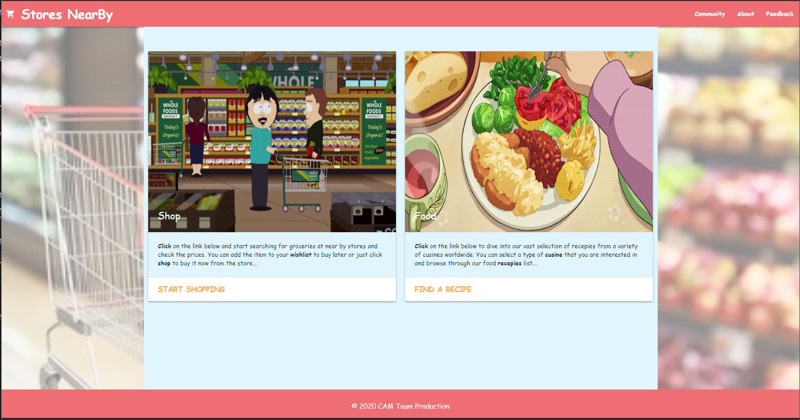

# APIs: Stores Nearby

Our web application allows a user to find products in the stores nearby based on their zip code and search query. The purpose is to narrow down their scavenger hunt for the products they're looking for by displaying the available items in the stores nearby. Meanwhile, we know many of you are concerned about healthy eating, so you can check out the classic recipes from around the world with food calories information.


## User Story

```
As a user, I want to see the available item and the product price in the nearby stores (target: Kroger) within 15 miles of radius. Meanwhile, I also want to find receipts to prepare nutritious and delicious food. so that I can buy cheaper products and prepare yummy food.


```

## Acceptance Criteria

```
Under Start Shopping Page:
WHEN I search for a product and zip code
THEN I am presented with the product price, product name and product image
WHEN I view current weather conditions for that city
WHEN I click on SHOP button
THEN I will be directed to the product website 
WHEN I click on WISHLIST button
THEN the product price, product name will be stored under My Wishlist
WHEN I open My Wishlist
THEN I am presented with all the products that I added to Wishlist previously. If I want more product information, I can click the item under My Wishlist to check out the product website.
WHEN I click the next page
THEN I am again presented with more products met the search criteria. 

Under Find Receipt Page:
THEN I am presented with the receipt.
WHEN I select the type of Cuisines, with options from different countries
THEN I am presented with dish name and dish image
WHEN I select the type of Cuisines, with options from different diets,
THEN I am presented with dish name and dish image
WHEN I search for food name
THEN I am presented with dish name and dish image
WHEN I click on Red Button on the image
THEN I am presented with the receipt   
WHEN I click the next page
THEN I am again presented with more products met the search criteria. 


The following image demonstrates the application functionality:



## Review

* The URL of the deployed application.
https://miteshmodi003.github.io/StoresNearBy/

* The URL of the GitHub repository. 
https://github.com/Miteshmodi003/StoresNearBy


- - -
© 2020 CAM Team Production All Rights Reserved.
